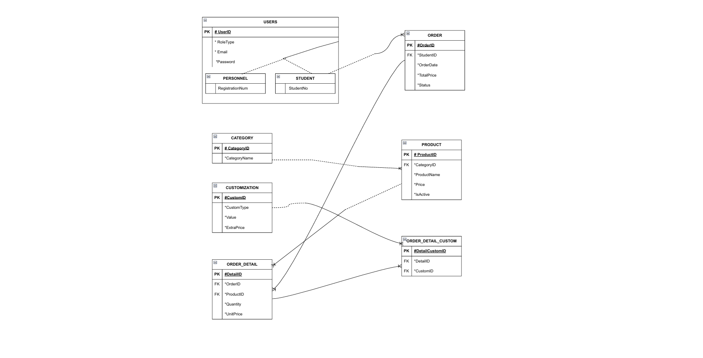

# Relational Database Architecture: Client-Server Order Management System

This repository contains the relational database architecture and SQL implementation for a campus cafeteria ordering system. The project focuses on data integrity, entity inheritance (Supertype/Subtype modeling), and strict normalization up to the 3rd Normal Form (3NF).

## 1. System Architecture & Entity-Relationship Model

The logical design is built upon standard relational database principles, utilizing specific architectural patterns to manage users, products, and complex order customizations.



### 1.1. Inheritance Model (Supertype / Subtype)

To prevent data redundancy and maintain centralized authentication, the user hierarchy is modeled using a Supertype/Subtype architecture.

- **`USERS` (Supertype):** Encapsulates shared attributes like `Email` and `Password` for all system actors.
- **`STUDENT` & `PERSONNEL` (Subtypes):** Inherit from the `USERS` table via a mandatory "is-a" relationship, holding only role-specific data (e.g., `StudentNo`, `RegistrationNum`).

### 1.2. Resolving N:M Relationships with Bridge Tables

A single order can contain multiple products, and a single product can have multiple customizations (e.g., extra syrup, alternative milk type). This is managed via bridge tables:

- **`ORDER_DETAIL`:** Resolves the Many-to-Many relationship between `ORDER` and `PRODUCT`.
- **`ORDER_DETAIL_CUSTOM`:** Connects specific order lines to the `CUSTOMIZATION` catalog, ensuring that extra parameters are strictly tied to a `DetailID`.

## 2. Normalization & Data Integrity

The database schema is normalized to 3NF to eliminate anomalies, with one conscious engineering exception for performance.

- **1NF (Atomic Values):** Order items are not stored as comma-separated strings. They are broken down into atomic rows within the `ORDER_DETAIL` table.
- **2NF (No Partial Dependency):** Surrogate primary keys (e.g., `DetailID`, `DetailCustomID`) are utilized in bridge tables instead of composite keys to eliminate partial dependencies structurally.
- **3NF (No Transitive Dependency):** Category names are isolated in a separate `CATEGORY` table. The `PRODUCT` table only holds the `CategoryID` foreign key, breaking the transitive dependency between a product and its category string.
- **Intentional Denormalization:** The `TotalPrice` column in the `ORDER` table is a calculated field derived from `ORDER_DETAIL` (`Quantity * UnitPrice`). While strictly violating 3NF, this denormalization was implemented to reduce server load and avoid heavy `SUM()` aggregations during frequent read operations (e.g., listing past orders).

## 3. Core Database Operations (DML)

The system relies on complex SQL queries for data extraction and business intelligence reporting. Below are key examples of the implemented logic:

### Subquery: Identifying Premium Products

Filters menu items that are priced above the overall catalog average by nesting an aggregate function within the `WHERE` clause.

```sql
SELECT ProductName, Price
FROM product
WHERE Price > (SELECT AVG(Price) FROM product);
```

### Multi-Table INNER JOIN: Comprehensive Order History

```sql
SELECT s.StudentNo, o.OrderDate, p.ProductName, od.Quantity
FROM student s
INNER JOIN `order` o ON s.UserID = o.StudentID
INNER JOIN order_detail od ON o.OrderID = od.OrderID
INNER JOIN product p ON od.ProductID = p.ProductID;
```

### Utilizes GROUP BY and arithmetic operations on joined tables to generate business intelligence regarding total units sold and revenue per category.

```sql
SELECT c.CategoryName, SUM(od.Quantity) AS Total_Units_Sold,
SUM(od.Quantity * od.UnitPrice) AS Total_Revenue
FROM category c
INNER JOIN product p ON c.CategoryID = p.CategoryID
INNER JOIN order_detail od ON p.ProductID = od.ProductID
GROUP BY c.CategoryName;
```

### Filters and retrieves orders strictly placed on the current system date using built-in temporal functions. This logic is essential for daily cafeteria operations and end-of-day financial reconciliations.

```sql
SELECT OrderID, OrderDate, TotalPrice
FROM `order`
WHERE DATE(OrderDate) = CURDATE();
```

### String Manipulation: Dynamic Username Generation

Parses user email addresses to automatically generate standardized, uppercase usernames. This demonstrates server-side string manipulation and data formatting prior to client-side UI rendering.

```sql
SELECT UPPER(SUBSTRING_INDEX(Email, '@', 1)) AS Username
FROM users;
```

## 4. Database Deployment & Initialization

The complete physical database schema, including all CREATE TABLE statements, integrity constraints (CHECK, UNIQUE, FOREIGN KEY), and mock data insertions, is isolated in the `cafeteriaproject_db.sql` file.

To spin up the database environment locally:

1. Ensure you have a running MariaDB or MySQL server (e.g., via XAMPP, Docker, or standalone installation).

2. Execute the `cafeteriaproject_db.sql` script within your database client (such as MySQL Workbench or phpMyAdmin).

3. The script will automatically construct the relational architecture and populate the tables with testing data, allowing you to run the aforementioned DML queries immediately.
