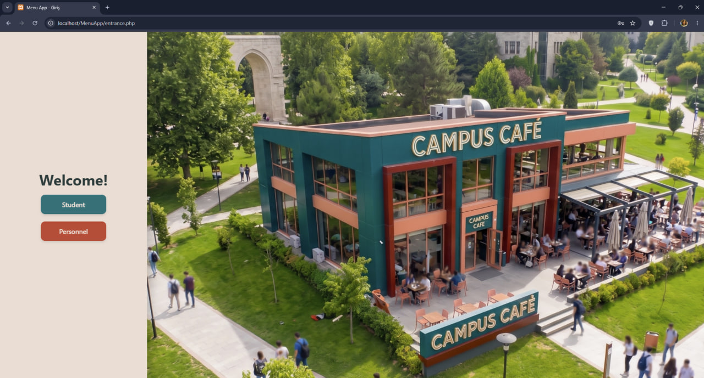
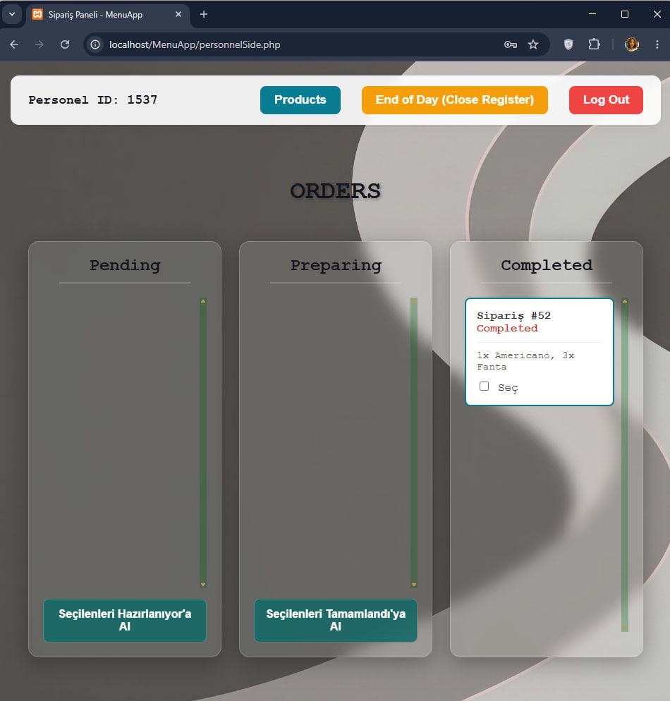

# ☕ CampusCafe Menu App - Frontend

This repository contains the frontend source code for a web-based menu system developed for a university campus cafeteria. The application provides a seamless experience for students to place orders and a dedicated dashboard for personnel to manage them.

_*(Note: For database setup, tables, and backend configuration, please refer to the [Database Documentation](Database/README.md).)*_

## ✨ Features (User Interface)

**Student/User Interface:**

- Secure login using Student ID and password (`entrance.php`).
- Dynamic, categorized menu layout (Hot Beverages, Cold Beverages, Bakery, Desserts, etc.).
- Interactive product customization modals (selecting milk type, syrups, and sizes).
- Real-time cart management and total price calculation.
- Order confirmation page with unique Order ID generation (`menu.php`).

**Personnel Control Panel:**

- Dedicated login portal for cafeteria staff.
- Real-time order tracking dashboard divided into Pending, Preparing, and Completed stages.
- A Product Control Panel to update prices directly from the user interface.

## 🛠️ Technologies Used

The frontend of this project was built using the following technologies:

- **HTML5 & CSS3:** For page structuring, grid/flexbox layouts, and custom styling (buttons, product cards, hover effects).
- **JavaScript:** To handle dynamic UI interactions such as cart logic, modal toggling, live price calculations, and seamless state updates.
- **PHP:** Utilized for page routing, modularizing the UI components, and managing user/personnel sessions.

## 📁 Folder Structure

The repository is organized with a clear and understandable architecture:

- `/images/`: Contains all static assets, background graphics, and product images used in the UI.
- `/js/`: JavaScript files responsible for frontend logic (cart calculations, modals, etc.).
- `/styles/`: CSS files that dictate the visual design and responsiveness of the application.
- `entrance.php`: The main landing and authentication page for both students and personnel.
- `menu.php`: The primary shopping interface where students browse and order.
- `personnelSide.php`: The admin dashboard for staff to manage orders and inventory pricing.

## 🚀 Setup and Execution

To run the frontend smoothly, the project should be hosted on a local server environment (e.g., XAMPP, WAMP, or similar) and connected to the database.

1. Clone this repository: `git clone [https://github.com/edasahaan/CampusCafe_MenuApp.git]`
2. Move the project folder into your local server's root directory (e.g., `htdocs` or `www`).
3. Important: To set up the required database tables and connections, please follow the instructions in the [Database Documentation](Database/README.md) prepared by my teammate Ebrar Gürbüz.
4. Open your web browser and navigate to `http://localhost/MenuApp/entrance.php` to launch the application.

## 📸 Screenshots

